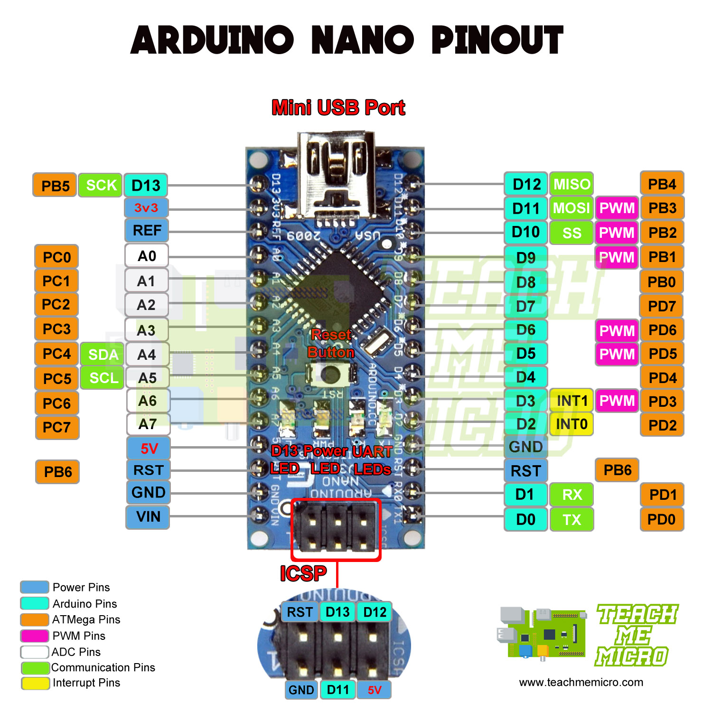

# 4WD BT Robot Car V2.0 Description
#### [4WD BT Robot Car V2.0](https://wiki.keyestudio.com/KS0470_Keyestudio_4WD_BT_Robot_Car_V2.0_Kit_for_Arduino)
#### [3 Channel Infrared Tracking Sensor](https://wiki.keyestudio.com/KS0470_Keyestudio_4WD_BT_Robot_Car_V2.0_Kit_for_Arduino#Project_10:_Line_Tracking_Robot)
#### [1 Channel Infrared Tracking Sensor](https://wiki.keyestudio.com/Ks0050_keyestudio_Line_Tracking_Sensor)
#### [HC-SR04 ultrasonic sensor ](https://wiki.keyestudio.com/KS0470_Keyestudio_4WD_BT_Robot_Car_V2.0_Kit_for_Arduino#Project_5:_Ultrasonic_Sensor)
#### [Datasheet](/Datesheet.pdf)

# Pinouts

