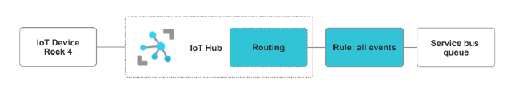
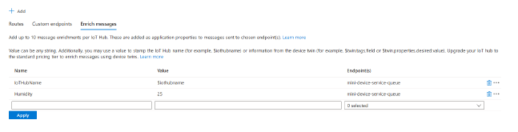
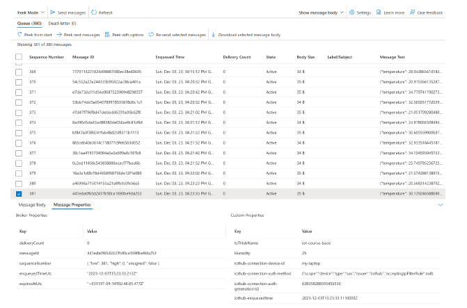
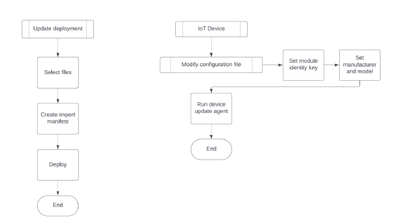
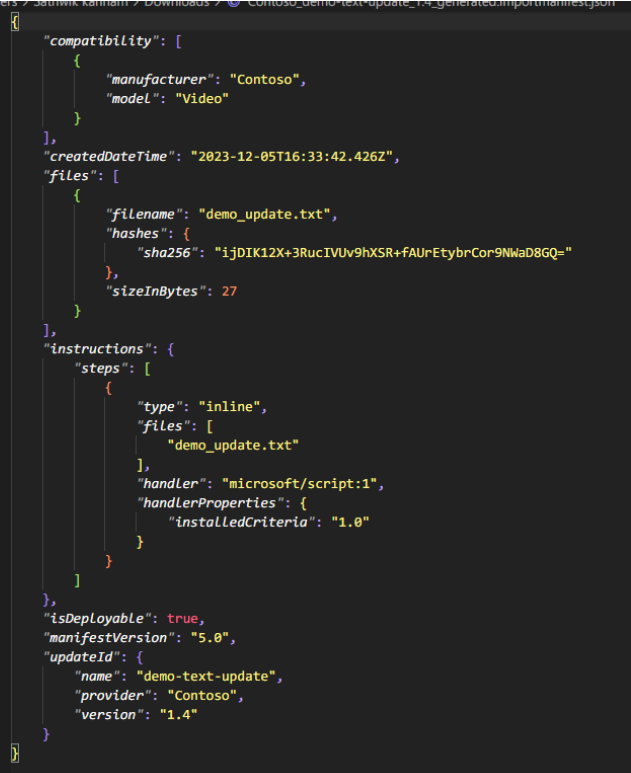
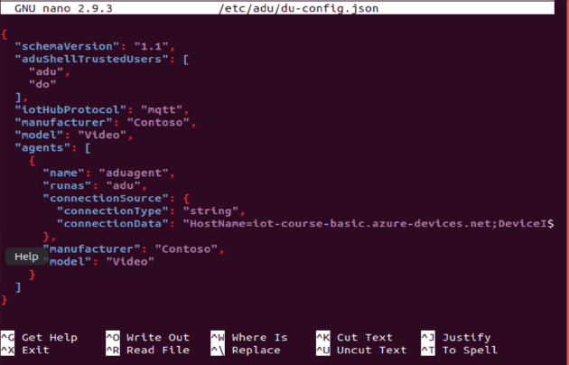
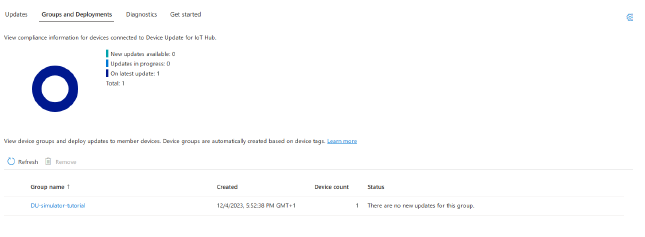
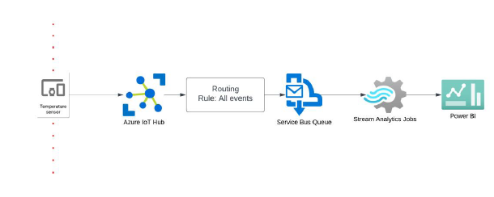
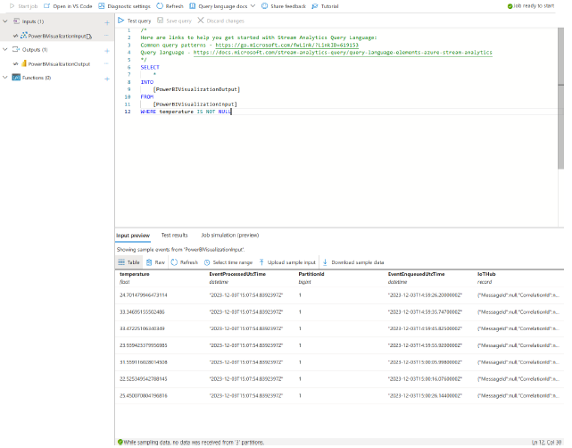
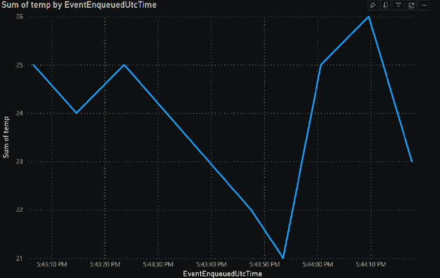

# Lab 2: Systems Design for Internet of Things

This report details the work performed in Lab 2 of the Internet of Things Design (DT373B) course during the Autumn Semester 2023 at Kristianstad University, Sweden[cite: 1].

## Introduction

This lab explores the use of visualization of messages sent from a simulated temperature sensor with Rock 4. Furthermore, custom message routings are set up to achieve this goal[cite: 4]. In addition, the lab explores the use of device updates from cloud to device using a simulated Ubuntu virtual machine[cite: 5].

## Route Device Message to Storage

The same infrastructure as in Lab 1 is used for Lab 2, as shown in Figure 1[cite: 7]. The service bus queue stores all incoming events from the IoT Hub in a queue regardless of the device[cite: 7].

## Message Enrichments

Implementing message enrichments with Azure is remarkably straightforward[cite: 9]. One can simply specify the value-key pair in the Message Routing section of the IoT Hub[cite: 10]. Additionally, Azure allows for the inclusion of dynamic key-pair values such as "\$iothubname", which automatically appends the hub name to every incoming message[cite: 11]. The subsequent figure provides a validation of the message enrichment implementation, demonstrating the ease and efficiency of this process[cite: 12].

As seen in Figure 3, every message sent to the IoT hub has message enrichments called "IoTHubName" and "Humidity"[cite: 15].

## Managing Device Updates

Creating and deploying updates requires multiple components: a device update agent, a payload (a file to update), and an import manifest file[cite: 16]. For this setup, a device was simulated using an Ubuntu virtual machine which runs a device update agent in the background[cite: 17]. The import manifest specifies the metadata related to the update itself, such as which devices the update is targeted to, the payload, update handler, and much more[cite: 18].

### Update Deployment Flowchart

According to Figure 4, updating devices requires a setup at both the device and cloud side of the infrastructure[cite: 21]. The device needs to have a device update agent running constantly, which requires a configuration file indicating the current version of the device and telling Azure what device it is[cite: 22]. On the deployment side, the procedure is quite straightforward: select files to update, select the compatible update handler, and create an import manifest file to manage the update[cite: 23].

### Import Manifest

According to Figure 5, the manifest uses compatibility parameters such as manufacturer and model to isolate the update to specific devices[cite: 25]. Furthermore, it also contains information regarding the payload such as its reference to the Azure Storage Container, and its hashed value (SHA256) for data integrity purposes[cite: 25]. Installed criteria is an indicator that is used to deploy any update given the update satisfies the criteria[cite: 26]. In other words, it is the minimum version required for an upcoming update[cite: 27].

### Device Configuration

As shown in Figure 6, each device must have a configuration file that specifies the primary module identity[cite: 30]. The owner of the device must manually enter this information in the configuration file so that Azure IoT Hub can determine the device's status based on its version and presence[cite: 31]. Additionally, other parameters such as manufacturer and model can be set to create customized updates for specific devices[cite: 32].

As seen in Figure 7, each device is grouped in terms of its version, and the update can be manually deployed to a specific device[cite: 35].

## Real-time Data Visualization

Stream Analytics plays a crucial role in enabling data visualization, necessitating both input and output capabilities[cite: 37]. For the input, all events from the IoT Hub endpoint are fed into the Stream Analytics job[cite: 38]. Conversely, the output is configured as a Power BI report[cite: 39]. It's noteworthy that the output is stored in a table format, facilitating data visualization through a variety of plots[cite: 40]. Moreover, preprocessing tasks can be executed on both the input and output by supplying a query[cite: 41]. The query essentially transfers all data from the input to the output, provided the temperature is not null, as depicted in Figure 8[cite: 42]. This process underscores the flexibility and power of Stream Analytics in handling and transforming data for visualization purposes[cite: 42].

As shown in Figures 9 and 10, the stream analytics job is functional as it can construct a scatter plot in real time[cite: 47].

## Important Lessons

* The design of Message Enrichments is both intuitive and powerful, significantly enhancing device-to-cloud communication[cite: 48]. It allows for the addition of custom fields to the metadata without requiring the device to modify its original message[cite: 49]. Furthermore, dynamic message enrichments can be added, as demonstrated with "\$iothubname"[cite: 50].
* Regarding Stream Analytics, initial skepticism was raised about how the job would know if a device were transmitting a temperature value, given that "WHERE temperature is NOT NULL" was added to the query[cite: 51]. This led to questions about whether the message needed to adhere to a specific structure for the job[cite: 52]. However, it was discovered that Stream Analytics automatically parses the body of the message, as the message is transmitted in JSON format[cite: 53].
* The IoT Hub serves as a gateway to multiple pipelines leading to other cloud services[cite: 54]. Interestingly, it allows for the dynamic transfer of messages to any endpoint based on the content of the message[cite: 55]. This capability opens up a wide range of possibilities for efficient and flexible data management[cite: 56].
* Managing updates for a device is a complex process that requires several prerequisites before deploying an update[cite: 57]. The device update agent API automatically updates any incoming updates from Azure as it runs in the background[cite: 58]. Creating a script to check for incoming updates would not be ideal, especially for a resource-constrained device like IoT[cite: 59]. However, most of the problems with updates occur when creating the import manifest file for each update, as Azure comes with a prebuilt handler for applying the updates[cite: 60]. Each handler performs differently. Therefore, one would need to have diverse insights regarding such a topic[cite: 61].

## Challenging in Implementing Cloud Services

In cases where cloud IoT services are unavailable, or one has to implement every essential part of the cloud and its services, several significant challenges could arise[cite: 62].

* **Infrastructure Setup**: Firstly, the infrastructure setup would be a complex task[cite: 63]. This involves installing a server, which requires a deep understanding of server hardware and software, network configurations, firewalls, and security protocols[cite: 63]. Moreover, one would need to set up additional servers for load balancing, which further increases the complexity of the infrastructure and its maintenance[cite: 64].
* **Scalability**: Secondly, scalability could pose a challenge[cite: 65]. Cloud services offer the advantage of easy scalability, which would be harder to achieve with a self-hosted solution, especially with a single server[cite: 65].
* **Coding**: Thirdly, writing the necessary code for both the server and client sides would require a broad set of programming skills and a good understanding of IoT protocols[cite: 66]. In other words, one would need to write APIs for client use cases[cite: 67].
* **Security**: Fourthly, security would be a major concern, as one would need to implement robust security measures to protect the server and the data it holds[cite: 68]. Moreover, any form of data loss could completely compromise the reliability and usability of the service[cite: 69].
* **Maintenance and Cost**: Lastly, maintenance and updates would be ongoing tasks, requiring dedicated resources to ensure the smooth operation of the server and to keep the system up to date with the latest security patches and updates[cite: 70]. Furthermore, servers require cooling and high-performance equipment, which tremendously increases the cost of their maintenance[cite: 71].

These challenges highlight the value that cloud IoT services bring in terms of convenience, scalability, and security[cite: 72].