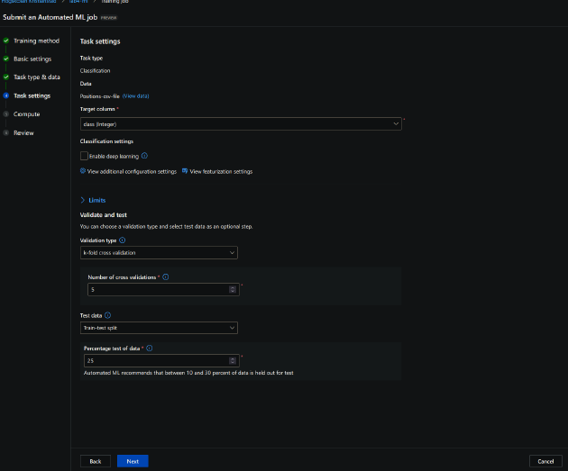
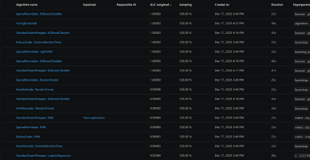
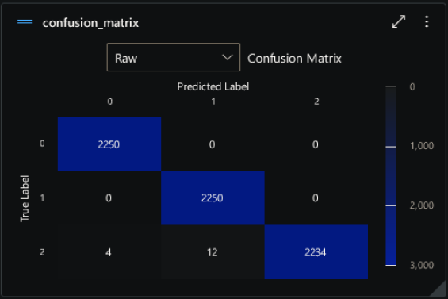
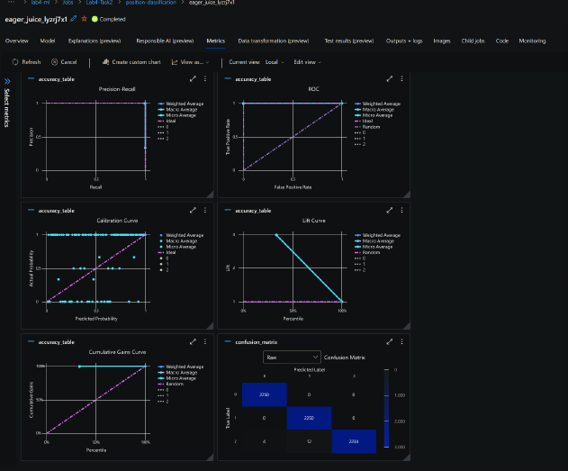

## Task 2: Azure AutoML

Azure AutoML is a cloud-based service that automates the time-consuming and iterative tasks of machine learning model development[cite: 207]. It allows users to build machine learning models with high scale, efficiency, and productivity while maximizing model quality[cite: 208]. Azure AutoML uses automated machine learning (AutoML) to select the best machine learning algorithm for your specific data[cite: 209]. During training, Azure Machine Learning creates several pipelines in parallel that try different algorithms and parameters[cite: 210]. The service iterates through ML algorithms paired with feature selections, where each iteration produces a model with a training score[cite: 211]. The process is halted once it hits the exit criteria defined in the experiment (in our setup, no exit criteria is defined)[cite: 212]. An end user can interface with Azure AutoML by using the Azure Machine Learning studio, which provides a no-code experience for creating and running automated machine learning experiments[cite: 213].

### Method

1. Import the `mpu6050` and `pandas` libraries[cite: 214].
2. Set the `FREQUENCY` of data collection to 50 Hz[cite: 214].
3. Define the class as "fast walking", "standing", or "laying down"[cite: 215].
4. Initialize the sensor object with the address 0x68[cite: 215].
5. Set the start time to the current time[cite: 216].
6. Set the end time to 60 seconds after the start time[cite: 216].
7. Create an empty list called `data`[cite: 217].
8. While the current time is less than the end time, do the following:
   a. Get the acceleration data from the sensor[cite: 218].
   b. Get the gyroscope data from the sensor[cite: 218].
   c. Append the acceleration and gyroscope data to the `data` list[cite: 219].
   d. Wait for 1/FREQUENCY seconds[cite: 220].
9. Create a pandas DataFrame from the `data` list with columns 'ax', 'ay', 'az', 'gx', 'gy', 'gz'[cite: 221].
10. Add a new column to the DataFrame called 'class' with the value of `_class`[cite: 221].
11. Export the DataFrame as a CSV file[cite: 222].

Pseudocode 2 outlines the process of collecting accelerometer and gyroscope data from the MPU6050 sensor[cite: 222]. Configuring AutoML requires plug-and-play and no code[cite: 223]. Training our models using the data from the MPU6050 requires us to transfer the standard CSV file to the AutoML proprietary blob storage[cite: 223]. Upon uploading, the CSV file is converted to MLTABLE format, which is the tabular format of the CSV[cite: 224]. As shown in Figure 2, we used classification with k-fold cross-validation with k set to 5 and 25% train-test split[cite: 225].

According to Figure 3, all the models with featurization and normalization resulted in 100% accuracy[cite: 228]. However, RandomForest and KNN with various normalization techniques suffered to reach 100%, though they managed to achieve approximately 100% accuracy[cite: 229]. The AutoML service provides more complex metrics including accuracy, a confusion matrix (Figure 4), a ROC curve, a calibration curve, a lift curve, and much more (Figure 5)[cite: 230].

The results of KNN with StandardScaler Wrapper from AutoML are comparable to the results from the Machine Learning course[cite: 233]. The results from the other course also yielded ~100% accuracy, and the results from AutoML yielded 99.99%[cite: 234]. Such a high accuracy is due to sitting, standing, and fast-walking being distinct positions[cite: 235]. However, this is not an apples-to-apples comparison as StandardScaler Wrapper was not performed on KNN in our previous course[cite: 236]. Nevertheless, both models performed identically[cite: 237].

### Challenges

Azure AutoML is extremely intuitive and requires no code to perform machine learning applications[cite: 237]. Therefore, no challenges were encountered[cite: 238].